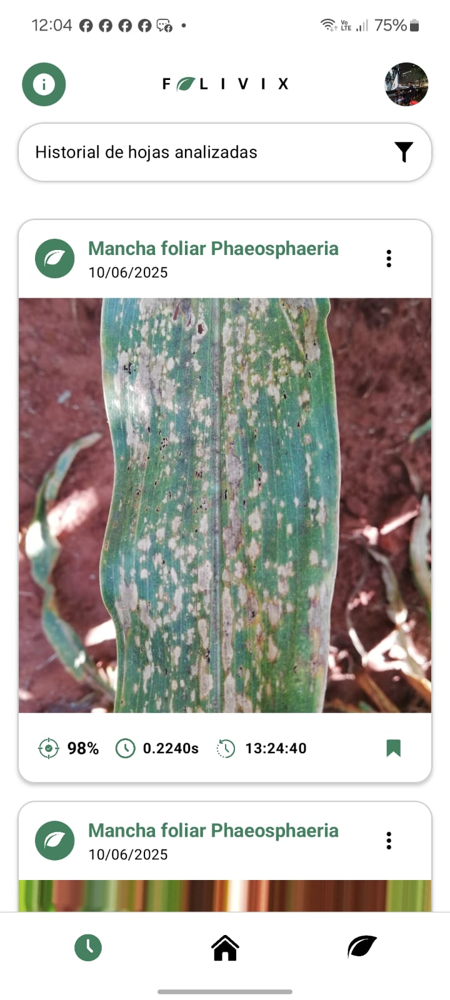

# FOLIVIX - Android Maize Leaf Disease Identifier


## Table of Contents
1. [About The Project](#about-the-project)
2. [Screenshots](#screenshots)
3. [Features](#features)
4. [Architecture & Tech Stack](#architecture--tech-stack)
5. [Connecting to the Backend](#connecting-to-the-backend)
6. [Project Structure](#project-structure)
7. [Getting Started](#getting-started)
   - [Prerequisites](#prerequisites)
   - [Installation](#installation)
8. [Configuration](#configuration)
9. [License](#license)

## 1. About The Project

**FOLIVIX** is a modern, native Android application designed for the rapid and accurate identification of foliar diseases in maize plants. It serves as a user-friendly mobile client that leverages a powerful, remote machine learning model (a Vision Transformer) to perform real-time image analysis.

The app allows users to capture or upload images of maize leaves and receive an instant diagnosis, complete with a confidence score. This provides an accessible and powerful tool for farmers, agronomists, and researchers to monitor crop health directly from the field.

This application is built with a focus on a clean, scalable architecture and a seamless user experience, incorporating features like multi-user profile management, detailed analysis history, and an in-app educational hub for disease information.

## 2. Screenshots

| | | |
|:----------------------------------------------------------:|:----------------------------------------------------------:|:----------------------------------------------------------:|
|  |  |  |
|  |  |  |

## 3. Features

-   **🌿 AI-Powered Disease Identification**: Analyze maize leaves by taking a photo or selecting one from the gallery. The app is designed to identify 5 common diseases (Common Rust, Gray Leaf Spot, Northern Leaf Blight, Phaeosphaeria Leaf Spot, Southern Rust) and healthy leaves.

-   **✂️ In-App Image Cropping**: Features an integrated image cropper (`uCrop`) to allow users to focus on the most relevant area of the leaf before analysis, improving prediction accuracy.

-   **👥 Multi-User Profile Management**: Supports up to 3 distinct user profiles. Each profile maintains its own separate analysis history, statistics, and personalized settings.

-   **📈 Comprehensive Analysis History**: Every saved analysis is stored locally and displayed in a filterable, chronological feed. Users can filter results by disease type, date, and prediction confidence.

-   **📊 Interactive Dashboard**: The home screen provides a visual summary of all analyses, including a pie chart of disease distribution, total leaves analyzed, and average prediction accuracy.

-   **📚 In-App Disease Information Hub**: Serves as an educational resource with detailed descriptions, symptoms, and control methods for each detectable disease, complete with multiple high-quality reference images.

-   **🔧 Configurable Backend Server**: The IP address of the backend prediction server can be easily configured within the app, allowing for flexibility in development, testing, and various network environments.

## 4. Architecture & Tech Stack

This project is built using modern Android development practices and a robust, scalable architecture.

-   **Architecture**: **MVVM (Model-View-ViewModel)** and the **Repository Pattern** to ensure a clean separation of concerns between the UI, business logic, and data layers.
-   **UI**: Built entirely with **Jetpack Compose**, Google's modern declarative UI toolkit, for a dynamic and responsive user interface.
-   **Dependency Injection**: **Hilt** is used to manage dependencies throughout the application, simplifying object creation and promoting modularity.
-   **Asynchronous Programming**: **Kotlin Coroutines** and **Flow** are used extensively for managing background threads and handling asynchronous data streams from the data layer to the UI.
-   **Networking**: **Retrofit** & **OkHttp** for making efficient and type-safe API calls to the backend. **Gson** is used for JSON serialization/deserialization.
-   **Navigation**: **Jetpack Navigation for Compose** handles all in-app screen transitions and the navigation graph.
-   **Data Persistence**:
    -   **Jetpack DataStore**: For storing user preferences like the server IP address and the last active user ID.
    -   **Custom File Storage**: A structured, file-based system (`FileStorageManager`) for storing user profiles, analysis metadata, and images locally on the device's internal storage.
-   **Image Handling**:
    -   **Coil**: For loading, caching, and displaying images asynchronously in Jetpack Compose.
    -   **uCrop**: For providing a powerful and customizable image cropping experience.

## 5. Connecting to the Backend

The FOLIVIX mobile app is a client designed to communicate with a remote backend server where the machine learning model is hosted. This server is expected to expose a REST API for predictions.

### API-Driven Workflow
The interaction is designed to be simple and efficient:

1.  **Image Selection**: The user captures or selects an image of a maize leaf within the app.
2.  **API Request**: The app sends the image via an HTTP `multipart/form-data` POST request to the `/predict` endpoint of the running backend server.
3.  **Backend Processing**: The server receives the image, processes it, and performs inference using its ML model.
4.  **JSON Response**: The server returns the prediction results in a structured `JSON` format, including the predicted class, confidence score, and processing time.
5.  **Display Results**: The FOLIVIX app parses the JSON response and displays the diagnosis to the user in a clear, easy-to-understand interface.

This client-server architecture allows the heavy computational work to be offloaded to a more powerful machine, keeping the mobile app lightweight and fast.

## 6. Project Structure

```text

FOLIVIX/
├── .gradle/
├── .idea/
├── .kotlin/
├── app/
│   ├── build/
│   ├── src/
│   │   ├── androidTest/
│   │   ├── main/
│   │   │   ├── java/
│   │   │   │   └── com/
│   │   │   │       └── example/
│   │   │   │           └── folivix/
│   │   │   │               ├── data/
│   │   │   │               │   ├── preferences/
│   │   │   │               │   │   └── AppPreferences.kt
│   │   │   │               │   ├── repository/
│   │   │   │               │   │   ├── AnalysisRepository.kt
│   │   │   │               │   │   ├── AnalysisRepositoryImpl.kt
│   │   │   │               │   │   ├── DiseaseRepository.kt
│   │   │   │               │   │   ├── DiseaseRepositoryImpl.kt
│   │   │   │               │   │   ├── UserRepository.kt
│   │   │   │               │   │   └── UserRepositoryImpl.kt
│   │   │   │               │   └── storage/
│   │   │   │               │       └── FileStorageManager.kt
│   │   │   │               ├── di/
│   │   │   │               │   └── AppModule.kt
│   │   │   │               ├── model/
│   │   │   │               │   ├── AnalysisResult.kt
│   │   │   │               │   ├── DiseaseInfo.kt
│   │   │   │               │   ├── DiseaseTip.kt
│   │   │   │               │   └── User.kt
│   │   │   │               ├── network/
│   │   │   │               │   ├── ApiService.kt
│   │   │   │               │   ├── PredictionResponse.kt
│   │   │   │               │   └── RetrofitClient.kt
│   │   │   │               ├── ui/
│   │   │   │               │   ├── components/
│   │   │   │               │   │   └── FolivixComponents.kt
│   │   │   │               │   ├── screens/
│   │   │   │               │   │   ├── main/
│   │   │   │               │   │   │   ├── BackgroundScreen.kt
│   │   │   │               │   │   │   ├── HomeScreen.kt
│   │   │   │               │   │   │   ├── IdentifyScreen.kt
│   │   │   │               │   │   │   ├── InfoScreen.kt
│   │   │   │               │   │   │   ├── MainScreen.kt
│   │   │   │               │   │   │   ├── UserManualScreen.kt
│   │   │   │               │   │   │   └── UserProfileScreen.kt
│   │   │   │               │   │   ├── profile/
│   │   │   │               │   │   │   ├── CreateProfileScreen.kt
│   │   │   │               │   │   │   ├── ManageProfilesScreen.kt
│   │   │   │               │   │   │   └── ProfileSelectionScreen.kt
│   │   │   │               │   │   └── splash/
│   │   │   │               │   │       ├── SplashScreen1.kt
│   │   │   │               │   │       └── SplashScreen2.kt
│   │   │   │               │   └── theme/
│   │   │   │               │       ├── Color.kt
│   │   │   │               │       ├── Theme.kt
│   │   │   │               │       └── Type.kt
│   │   │   │               ├── util/
│   │   │   │               └── viewmodel/
│   │   │   │                   ├── HistoryViewModel.kt
│   │   │   │                   ├── HomeViewModel.kt
│   │   │   │                   ├── IdentifyViewModel.kt
│   │   │   │                   ├── InfoViewModel.kt
│   │   │   │                   ├── MainViewModel.kt
│   │   │   │                   └── UserProfileViewModel.kt
│   │   │   │               ├── FolivixApplication.kt
│   │   │   │               └── MainActivity.kt
│   │   │   ├── res/
│   │   │   │   ├── AndroidManifest.xml
│   │   │   │   └── ic_launcher-playstore.png
│   │   └── test/
│   ├── .gitignore
│   ├── build.gradle.kts
│   └── proguard-rules.pro
├── build/
├── gradle/
├── .gitignore
├── build.gradle.kts
├── gradle.properties
├── gradlew
├── gradlew.bat
├── local.properties
└── settings.gradle.kts

```

## 7. Getting Started

Follow these instructions to set up the project and run it on your local machine for development and testing purposes.

### Prerequisites

-   **Android Studio** Iguana | 2023.2.1 or later.
-   **JDK 11** or higher.
-   A running instance of the compatible **[Maize Leaf Disease Classification Backend](https://github.com/AlvaroVasquezAI/Maize_Leaf_Disease_Classification)**.

### Installation

1.  **Clone the Repository**
    ```sh
    git clone https://github.com/AlvaroVasquezAI/FOLIVIX.git
    ```
2.  **Open in Android Studio**
    -   Launch Android Studio.
    -   Select `File` > `Open` and navigate to the cloned project directory.
    -   Allow Android Studio to sync the Gradle files and download all dependencies.
3.  **Run the Application**
    -   Connect an Android device or start an emulator.
    -   Click the 'Run' button (▶) in Android Studio.

## 8. Configuration

For the app to function correctly, it must be able to communicate with the backend server.

1.  Ensure your Android device/emulator and the machine running the backend server are on the **same local network**.
2.  Launch the FOLIVIX application.
3.  After creating a profile, navigate to the **Main Screen**.
4.  Tap the **Information icon (`i`)** in the top-left corner to go to the Info Screen.
5.  Under the **"Configuración del servidor"** section, tap "Cambiar".
6.  Enter the local IP address of the machine running the prediction server (e.g., `192.168.1.10`). The app will automatically connect to port `5000`.

## 9. License

This project is distributed under the MIT License. See the `LICENSE` file for more information.
